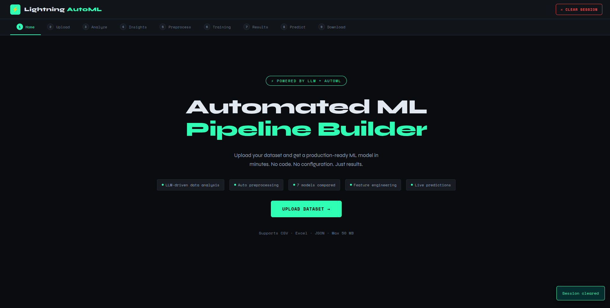
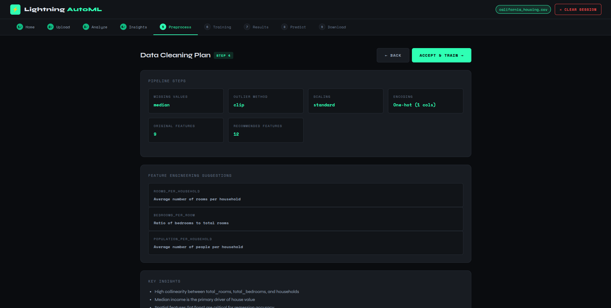
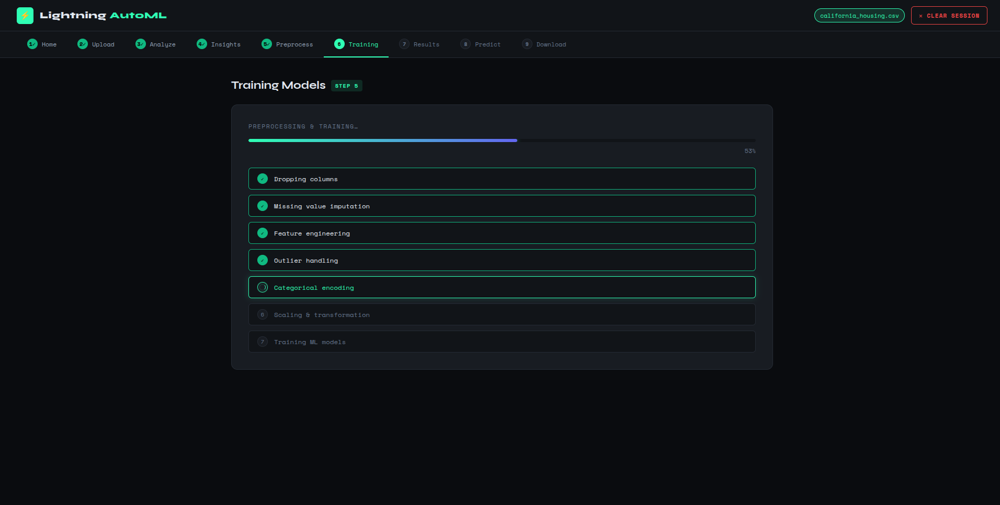

# ⚡ Lightning AutoML

An end-to-end Automated Machine Learning pipeline — upload a dataset, let the LLM-powered engine analyse it, preprocess it, train multiple models, and make predictions — all through a clean web UI.

---

## 📸 Screenshots

| Home | Upload & Configure |
|------|--------------------|
|  |  |

| Data Cleaning Plan | Training Plan |
|--------------------|---------------|
|  |  |

| Results | |
|---------|--|
|  |  |

---

## 🚀 Features

- **Smart Upload** — CSV, Excel, JSON support with auto encoding detection
- **LLM-Powered Analysis** — intelligent data quality scoring, outlier detection, correlation analysis
- **Auto Preprocessing** — missing value imputation, encoding, scaling, feature engineering
- **AutoML Training** — trains and ranks up to 7 models, picks the best automatically
- **Live Predictions** — single-row prediction with confidence scores and history
- **Downloadable Artifacts** — processed features, trained model, metrics, and reports

---

## 🐳 Docker Setup

The app runs on **port 7860** (required by Hugging Face Spaces).

### Build & Run Locally

```bash
# Build the image
docker build -t lightning-automl .

# Run with your API key
docker run -p 7860:7860 \
  -e GR_API_KEY=your_api_key_here \
  -e GR_MODEL_NAME=your_model_name_here \
  lightning-automl
```

Then open [http://localhost:7860](http://localhost:7860).

---

## 🔑 Environment Variables

| Variable         | Required | Description                              |
|------------------|----------|------------------------------------------|
| `GR_API_KEY`     | ✅ Yes   | LLM API key (e.g. Groq, OpenAI, etc.)   |
| `GR_MODEL_NAME`  | ✅ Yes   | Model name (e.g. `llama-3.3-70b-versatile`) |

### Setting Secrets on Hugging Face

Go to your Space → **Settings** → **Repository secrets** and add:
- `GR_API_KEY`
- `GR_MODEL_NAME`

---

## 📁 Project Structure

```
.
├── app/
│   ├── api/
│   │   ├── models.py          # Pydantic request/response models
│   │   ├── routes.py          # Analysis, training, prediction routes
│   │   └── upload_routes.py   # Upload & session management routes
│   ├── core/
│   │   ├── config.py          # App settings (env-driven)
│   │   ├── llm_engine.py      # LLM client wrapper
│   │   └── ml_types.py        # Enums & dataclasses
│   ├── services/
│   │   ├── data_analyzer.py   # LLM-powered data analysis
│   │   ├── data_prep_agent.py # Preprocessing pipeline
│   │   ├── pipeline_service.py# Orchestrates analysis → train → predict
│   │   └── session_service.py # Session state + file persistence
│   ├── util/
│   │   ├── feature_engine.py  # Feature engineering & target processing
│   │   └── file_handler.py    # Multi-format file loader
│   ├── static/                # Frontend (HTML/CSS/JS)
│   └── main.py                # FastAPI app entrypoint
├── automl_trainer.py          # Model training & evaluation
├── ml_pipeline.py             # Pipeline orchestration helpers
├── Dockerfile
├── requirements.txt
└── README.md
```

---

## 🔄 Pipeline Workflow

```
Upload Dataset
     ↓
Configure (target column, task type, test split)
     ↓
Analyze (LLM generates preprocessing plan + data insights)
     ↓
Train (preprocess → fit up to 7 models → rank by metric)
     ↓
Predict (transform input → inference → confidence score)
     ↓
Download (model, features, metrics, report)
```

---

## 📊 Supported Tasks

| Task           | ML Type      | Metric         |
|----------------|--------------|----------------|
| Classification | Supervised   | Accuracy / F1  |
| Regression     | Supervised   | R² / RMSE      |
| Clustering     | Unsupervised | Silhouette     |

---

## 🌐 API Endpoints

| Method   | Endpoint                  | Description                    |
|----------|---------------------------|--------------------------------|
| `POST`   | `/api/upload`             | Upload dataset file            |
| `POST`   | `/api/configure`          | Set target, task, test split   |
| `POST`   | `/api/analyze`            | Run LLM-powered analysis       |
| `GET`    | `/api/insights`           | Get data insights              |
| `GET`    | `/api/preprocessing`      | Get preprocessing plan         |
| `POST`   | `/api/train`              | Run preprocessing + training   |
| `GET`    | `/api/results`            | Get training results           |
| `POST`   | `/api/predict`            | Single-row prediction          |
| `GET`    | `/api/predictions`        | Prediction history             |
| `GET`    | `/api/downloads`          | List downloadable files        |
| `GET`    | `/api/download/{key}`     | Download a specific file       |
| `GET`    | `/api/session`            | Current session status         |
| `DELETE` | `/api/session`            | Clear session                  |

Interactive docs available at `/docs` (Swagger UI).

---

## ⚠️ Notes

- This Space is single-session — one user at a time for best results.
- Max upload size: **50 MB**.
- Supported file formats: `csv`, `xlsx`, `xls`, `json`.